```mermaid
erDiagram

    %% ════════════════════════════════════
    %% МОДУЛЬ: AUTH (Django built-in)
    %% ════════════════════════════════════
    User {
        int id PK
        string username UK
        string first_name
        string last_name
        string email
        bool is_active
    }

    %% ════════════════════════════════════
    %% МОДУЛЬ: PERMISSIONS
    %% ════════════════════════════════════
    Company {
        int id PK
        string name UK
        string code UK
        text description
        bool is_active
        datetime created_at
        datetime updated_at
    }

    Department {
        int id PK
        int company_id FK
        int parent_department_id FK
        string name
        string code
        text description
        bool is_active
        datetime created_at
        datetime updated_at
    }

    Permission {
        int id PK
        string code UK
        string name
        string action
        string resource
        string scope
        bool is_active
        datetime created_at
    }

    Role {
        int id PK
        string name
        string code UK
        string category
        string scope
        bool is_system
        bool is_active
        int created_by_id FK
        datetime created_at
    }

    UserProfile {
        int id PK
        int user_id FK
        int company_id FK
        int department_id FK
        string position
        string phone
        string avatar
        bool is_system_admin
        bool is_active
        bool is_deleted
        datetime created_at
    }

    PermissionLog {
        int id PK
        int user_id FK
        string action
        string entity_type
        int entity_id
        json details
        string ip_address
        datetime created_at
    }

    PartnerAPIKey {
        int id PK
        string name
        string key_hash UK
        string key_encrypted
        text description
        json allowed_scopes
        bool is_active
        datetime created_at
        datetime last_used_at
        datetime expires_at
        int requests_per_minute
        int requests_per_day
    }

    %% ════════════════════════════════════
    %% МОДУЛЬ: REALTY
    %% ════════════════════════════════════
    Project {
        int id PK
        int company_id FK
        int created_by_id FK
        int updated_by_id FK
        string name
        string address
        text description
        string logo
        int min_floors
        int max_floors
        date cadastre_date_plan
        datetime created_at
        datetime updated_at
    }

    ProjectImage {
        int id PK
        int project_id FK
        string image
        string caption
    }

    BuildingType {
        int id PK
        string name UK
    }

    Building {
        int id PK
        int project_id FK
        int building_type_id FK
        int created_by_id FK
        int updated_by_id FK
        string name
        string status
        string address_detail
        int floors_count
        decimal ceiling_height
        string material
        date sales_start_date
        date cadastre_date_plan
        date cadastre_date_fact
        datetime created_at
        datetime updated_at
    }

    BuildingImage {
        int id PK
        int building_id FK
        string image
        string caption
    }

    BuildingLog {
        int id PK
        int building_id FK
        int user_id FK
        text action
        datetime created_at
    }

    Layout {
        int id PK
        int building_id FK
        string name
        string main_layout_image
        string extra_layout_image
        string floor_plan_image
        string usp_image
    }

    Property {
        int id PK
        int building_id FK
        int layout_id FK
        int created_by_id FK
        int updated_by_id FK
        string property_type
        string status
        string unit_number
        int floor
        string entrance
        string riser
        decimal area
        bool has_finishing
        decimal price
        text description
        datetime created_at
        datetime updated_at
    }

    Discount {
        int id PK
        int created_by_id FK
        int updated_by_id FK
        string name
        decimal percentage_value
        text comment
        date start_date
        date end_date
        string property_type
        bool is_active
        datetime created_at
    }

    DiscountLog {
        int id PK
        int discount_id FK
        int user_id FK
        text action
        datetime created_at
    }

    %% ════════════════════════════════════
    %% МОДУЛЬ: CRM
    %% ════════════════════════════════════
    PreciseSource {
        int id PK
        int created_by_id FK
        string name UK
        datetime created_at
    }

    RejectionReason {
        int id PK
        string name
        string reason_type
        bool is_active
    }

    ApplicationStatus {
        int id PK
        string code UK
        string name
        string color
        int order
        bool is_active
        bool is_final
        datetime created_at
    }

    Client {
        int id PK
        int company_id FK
        int created_by_id FK
        string full_name
        string email UK
        date date_of_birth
        string gender
        string marital_status
        string status
        string passport_series
        string passport_number
        string passport_issued_by
        date passport_issued_date
        string inn
        string pinfl
        text registration_address
        text billing_address
        text comment
        datetime created_at
        datetime updated_at
    }

    ClientPhoneNumber {
        int id PK
        int client_id FK
        string phone_number
        bool is_primary
    }

    ClientFile {
        int id PK
        int client_id FK
        int uploaded_by_id FK
        string file
        text comment
        datetime uploaded_at
    }

    ClientLog {
        int id PK
        int client_id FK
        int user_id FK
        text action
        datetime created_at
    }

    Application {
        int id PK
        int company_id FK
        int client_id FK
        int precise_source_id FK
        int rejection_reason_id FK
        int created_by_id FK
        string status
        string source
        string interested_property_type
        decimal min_area
        decimal max_area
        int min_floor
        int max_floor
        text notes
        datetime created_at
        datetime updated_at
    }

    ApplicationLog {
        int id PK
        int application_id FK
        int user_id FK
        text action
        datetime created_at
    }

    Meeting {
        int id PK
        int company_id FK
        int client_id FK
        int application_id FK
        int interested_building_id FK
        int creator_id FK
        int executor_id FK
        string status
        datetime planned_date
        datetime actual_date
        text comment
        text result_comment
        bool is_auto_created
        datetime created_at
        datetime updated_at
    }

    MeetingLog {
        int id PK
        int meeting_id FK
        int user_id FK
        text action
        datetime created_at
    }

    %% ════════════════════════════════════
    %% МОДУЛЬ: DEALS
    %% ════════════════════════════════════
    PurchasePurpose {
        int id PK
        string name UK
    }

    DealPaymentType {
        int id PK
        string name UK
    }

    Deal {
        int id PK
        int company_id FK
        int client_id FK
        int property_id FK
        int purchase_purpose_id FK
        int payment_type_id FK
        int created_by_id FK
        string status
        datetime booking_start_date
        datetime booking_end_date
        decimal initial_price
        decimal initial_price_per_sqm
        decimal contract_price
        string contract_number UK
        date contract_date
        string signed_document_scan
        date client_signature_date
        date company_signature_date
        text cancellation_reason
        string termination_document_scan
        date termination_date
        text notes
        datetime created_at
        datetime updated_at
    }

    DealLog {
        int id PK
        int deal_id FK
        int user_id FK
        text action
        datetime created_at
    }

    %% ════════════════════════════════════
    %% МОДУЛЬ: DOCUMENTS
    %% ════════════════════════════════════
    Template {
        int id PK
        int company_id FK
        int created_by_id FK
        string name
        string file
        json applies_to_property_types
        datetime created_at
        datetime updated_at
    }

    %% ════════════════════════════════════
    %% МОДУЛЬ: FINANCES
    %% ════════════════════════════════════
    FinancesPaymentType {
        int id PK
        string name UK
    }

    BeneficiaryAccount {
        int id PK
        int company_id FK
        int created_by_id FK
        string name
        text details
    }

    Payment {
        int id PK
        int company_id FK
        int deal_id FK
        int client_id FK
        int responsible_employee_id FK
        int payment_type_id FK
        int beneficiary_account_id FK
        int created_by_id FK
        decimal amount
        string currency
        string method
        string status
        date due_date
        date payment_date
        datetime created_at
        datetime updated_at
    }

    PaymentLog {
        int id PK
        int payment_id FK
        int user_id FK
        text action
        datetime created_at
    }

    %% ════════════════════════════════════
    %% МОДУЛЬ: REPORTS
    %% ════════════════════════════════════
    Plan {
        int id PK
        int project_id FK
        int year
        int month
        int contracting_units_plan
        decimal contracting_money_plan
        decimal revenue_money_plan
    }

    EmployeePlan {
        int id PK
        int employee_id FK
        int year
        int month
        int contracting_units_plan
        decimal contracting_money_plan
        decimal revenue_money_plan
    }

    %% ════════════════════════════════════
    %% МОДУЛЬ: TASKS
    %% ════════════════════════════════════
    Task {
        int id PK
        int company_id FK
        int department_id FK
        int creator_id FK
        int assignee_id FK
        int parent_task_id FK
        string title
        text description
        string status
        string priority
        datetime deadline
        datetime started_at
        datetime completed_at
        bool completed_with_delay
        decimal estimated_hours
        decimal actual_hours
        string tags
        datetime created_at
        datetime updated_at
    }

    TaskComment {
        int id PK
        int task_id FK
        int user_id FK
        text text
        string attachment
        datetime created_at
        datetime updated_at
    }

    TaskLog {
        int id PK
        int task_id FK
        int user_id FK
        text action
        json old_value
        json new_value
        datetime created_at
    }

    %% ════════════════════════════════════════════
    %% СВЯЗИ: PERMISSIONS
    %% ════════════════════════════════════════════
    Company ||--o{ Department : "departments"
    Department }o--o| Department : "parent_department"
    Role }o--o{ Permission : "permissions (M2M)"
    Role }o--o{ Company : "companies (M2M)"
    UserProfile ||--|| User : "user (1:1)"
    UserProfile }o--o| Company : "company"
    UserProfile }o--o| Department : "department"
    UserProfile }o--o{ Role : "roles (M2M)"
    PermissionLog }o--o| User : "user"
    PartnerAPIKey }o--o{ Company : "companies (M2M)"
    User ||--o{ Role : "created_by"

    %% ════════════════════════════════════════════
    %% СВЯЗИ: REALTY
    %% ════════════════════════════════════════════
    Company ||--o{ Project : "projects"
    Project ||--o{ Building : "buildings"
    Project ||--o{ ProjectImage : "gallery_images"
    Project ||--o{ Plan : "plans"
    BuildingType ||--o{ Building : "building_type"
    Building ||--o{ BuildingImage : "gallery_images"
    Building ||--o{ BuildingLog : "logs"
    Building ||--o{ Layout : "layouts"
    Building ||--o{ Property : "properties"
    Layout ||--o{ Property : "properties"
    Discount }o--o{ Building : "buildings (M2M)"
    Discount ||--o{ DiscountLog : "logs"

    %% ════════════════════════════════════════════
    %% СВЯЗИ: CRM
    %% ════════════════════════════════════════════
    Company ||--o{ Client : "clients"
    Company ||--o{ Application : "applications"
    Company ||--o{ Meeting : "meetings"
    Client ||--o{ ClientPhoneNumber : "phone_numbers"
    Client ||--o{ ClientFile : "files"
    Client ||--o{ ClientLog : "logs"
    Client ||--o{ Application : "applications"
    Client ||--o{ Meeting : "meetings"
    Client }o--o{ Client : "relatives (M2M)"
    PreciseSource ||--o{ Application : "precise_source"
    RejectionReason ||--o{ Application : "rejection_reason"
    Application ||--o{ ApplicationLog : "logs"
    Application }o--o{ Project : "interested_projects (M2M)"
    Application ||--o{ Meeting : "meetings"
    Building ||--o{ Meeting : "interested_building"

    %% ════════════════════════════════════════════
    %% СВЯЗИ: DEALS
    %% ════════════════════════════════════════════
    Company ||--o{ Deal : "deals"
    Client ||--o{ Deal : "deals"
    Property ||--o{ Deal : "deals"
    PurchasePurpose ||--o{ Deal : "purchase_purpose"
    DealPaymentType ||--o{ Deal : "payment_type"
    Deal ||--o{ DealLog : "logs"
    Deal }o--o{ Discount : "applied_discounts (M2M)"

    %% ════════════════════════════════════════════
    %% СВЯЗИ: DOCUMENTS
    %% ════════════════════════════════════════════
    Template }o--o{ Project : "applies_to_projects (M2M)"
    Template }o--o{ Building : "applies_to_buildings (M2M)"
    Template }o--|| Company : "company"

    %% ════════════════════════════════════════════
    %% СВЯЗИ: FINANCES
    %% ════════════════════════════════════════════
    Company ||--o{ BeneficiaryAccount : "beneficiary_accounts"
    Company ||--o{ Payment : "payments"
    Deal ||--o{ Payment : "payments"
    Client ||--o{ Payment : "payments"
    FinancesPaymentType ||--o{ Payment : "payment_type"
    BeneficiaryAccount ||--o{ Payment : "beneficiary_account"
    Payment ||--o{ PaymentLog : "logs"

    %% ════════════════════════════════════════════
    %% СВЯЗИ: REPORTS
    %% ════════════════════════════════════════════
    User ||--o{ EmployeePlan : "employee_plans"

    %% ════════════════════════════════════════════
    %% СВЯЗИ: TASKS
    %% ════════════════════════════════════════════
    Company ||--o{ Task : "tasks"
    Department ||--o{ Task : "tasks"
    Task }o--o| Task : "parent_task (subtasks)"
    Task ||--o{ TaskComment : "comments"
    Task ||--o{ TaskLog : "logs"
    Task }o--o{ User : "watchers (M2M)"
```

# ER Схема базы данных — Real Estate CRM

## Условные обозначения
- `||--o{` — один ко многим (обязательная связь)
- `||--o|` — один к одному
- `}o--o{` — многие ко многим
- `}o--o|` — многие к одному (необязательная)

---

---

## Сводная таблица модулей и сущностей

| Модуль | Сущности |
|--------|----------|
| **permissions** | `Company`, `Department`, `Permission`, `Role`, `UserProfile`, `PermissionLog`, `PartnerAPIKey` |
| **realty** | `Project`, `ProjectImage`, `BuildingType`, `Building`, `BuildingImage`, `BuildingLog`, `Layout`, `Property`, `Discount`, `DiscountLog` |
| **crm** | `PreciseSource`, `RejectionReason`, `ApplicationStatus`, `Client`, `ClientPhoneNumber`, `ClientFile`, `ClientLog`, `Application`, `ApplicationLog`, `Meeting`, `MeetingLog` |
| **deals** | `PurchasePurpose`, `DealPaymentType`, `Deal`, `DealLog` |
| **documents** | `Template` |
| **finances** | `FinancesPaymentType`, `BeneficiaryAccount`, `Payment`, `PaymentLog` |
| **reports** | `Plan`, `EmployeePlan` |
| **tasks** | `Task`, `TaskComment`, `TaskLog` |

## Ключевые M2M (многие ко многим)

| Связь | Junction table |
|-------|---------------|
| `Role ↔ Permission` | `permissions_role_permissions` |
| `Role ↔ Company` | `permissions_role_companies` |
| `UserProfile ↔ Role` | `permissions_userprofile_roles` |
| `PartnerAPIKey ↔ Company` | `permissions_partnerapikey_companies` |
| `Application ↔ Project` | `crm_application_interested_projects` |
| `Client ↔ Client` (родственники) | `crm_client_relatives` |
| `Deal ↔ Discount` | `deals_deal_applied_discounts` |
| `Discount ↔ Building` | `realty_discount_buildings` |
| `Template ↔ Project` | `documents_template_applies_to_projects` |
| `Template ↔ Building` | `documents_template_applies_to_buildings` |
| `Task ↔ User` (наблюдатели) | `tasks_task_watchers` |
